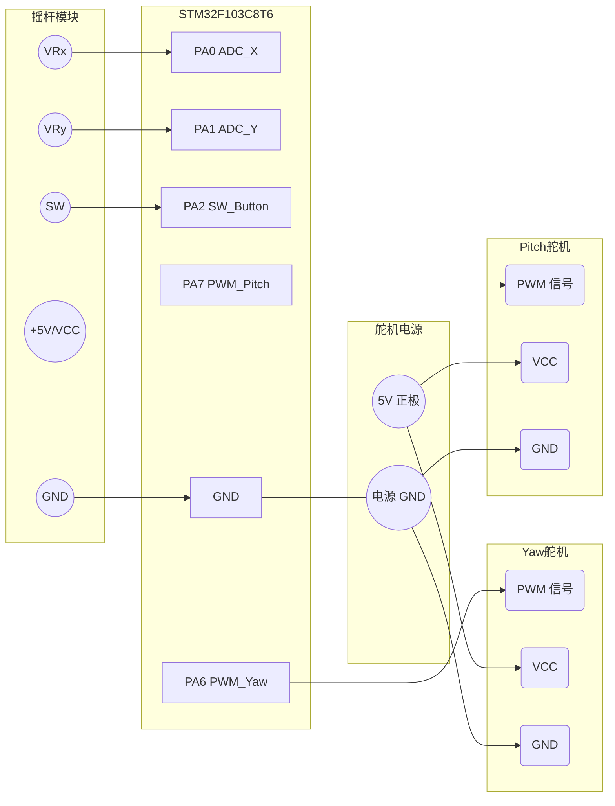

# 硬件接线图 (Wiring Diagram)

为了让摇杆和舵机正常工作，你需要按下表的引脚分配进行接线。

> [!WARNING]
> 大多数标准舵机（如 SG90 或 MG996R）工作时会拉走较大电流。**强烈建议**使用独立 5V 电源为舵机供电，而不要直接接在 STM32 的 5V/3.3V 引脚上，以防单片机复位或烧毁。舵机和单片机的 GND **必须连接在一起（共地）**！

### 1. 摇杆模块 (Joystick Module)
通常有 5 个引脚，与 STM32 的连接如下：

| 摇杆引脚 | 连接到 STM32 | 说明 |
| :--- | :--- | :--- |
| **GND** | `GND` | 接地 |
| **+5V** (或 VCC) | `3.3V` 或 `5V` | 摇杆电源（通常接 3.3V 即可，这样 ADC 量程匹配 0~3.3V） |
| **VRx** | `PA0` | X 轴模拟输出 (接 ADC1_IN0) |
| **VRy** | `PA1` | Y 轴模拟输出 (接 ADC1_IN1) |
| **SW** | `PA2` | 按键数字输出 (按下时接地，由程序内部上拉) |

---

### 2. 舵机 1：Yaw / 水平云台 (Pan)
通常有 3 根线（棕/红/橙 或 黑/红/白），接线如下：

| 舵机引脚 (颜色) | 连接 | 说明 |
| :--- | :--- | :--- |
| **GND** (棕色/黑色) | `电源负极` + `STM32 GND` | 必须和 STM32 共地 |
| **VCC** (红色) | `独立 5V 电源正极` | 舵机电源 |
| **PWM** (橙色/黄色/白色) | `PA6` | 信号控制线，接 TIM3_CH1 |

---

### 3. 舵机 2：Pitch / 垂直云台 (Tilt)
接线同上：

| 舵机引脚 (颜色) | 连接 | 说明 |
| :--- | :--- | :--- |
| **GND** (棕色/黑色) | `电源负极` + `STM32 GND` | 必须和 STM32 共地 |
| **VCC** (红色) | `独立 5V 电源正极` | 舵机电源 |
| **PWM** (橙色/黄色/白色) | `PA7` | 信号控制线，接 TIM3_CH2 |

---

### 🎨 简易系统连线图

