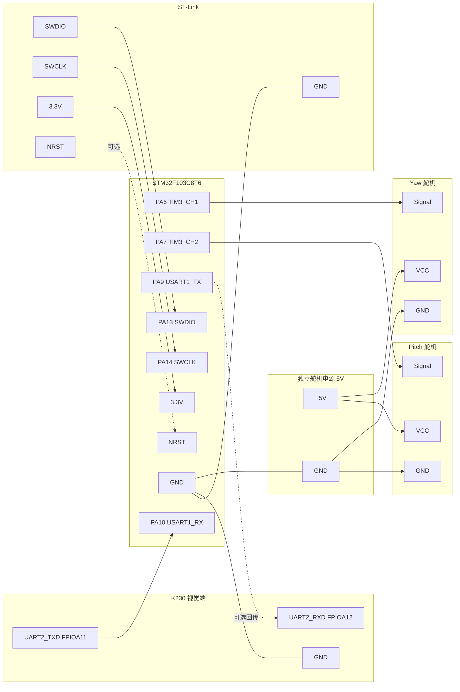

# 硬件接线图

当前工程的实际硬件不是摇杆控制，而是：K230 视觉端通过串口把目标偏差发给 STM32F103，STM32 再输出两路 PWM 控制双轴云台舵机。

## 0. 简化框图版

如果你想要类似手绘框图的效果，直接看这张： [简化接线框图.svg](简化接线框图.svg)

## 1. 核心接线总表

| 模块 | 信号/引脚 | 连接到 | 说明 |
| :--- | :--- | :--- | :--- |
| STM32F103C8T6 | PA6 | Yaw 舵机信号线 | TIM3_CH1，水平轴 PWM |
| STM32F103C8T6 | PA7 | Pitch 舵机信号线 | TIM3_CH2，俯仰轴 PWM |
| STM32F103C8T6 | PA9 | K230 UART2_RXD(可选) | STM32 USART1_TX，只有需要回传数据时才接 |
| STM32F103C8T6 | PA10 | K230 UART2_TXD | STM32 USART1_RX，接收视觉偏差数据 |
| STM32F103C8T6 | GND | K230 GND、舵机电源 GND | 所有模块必须共地 |
| STM32F103C8T6 | 3.3V/5V | 板载供电 | 按你的开发板供电方式选择 |
| Yaw 舵机 | VCC | 独立 5V 电源正极 | 不建议由 STM32 板载直接供电 |
| Yaw 舵机 | GND | 独立 5V 电源负极 | 同时与 STM32 GND 共地 |
| Pitch 舵机 | VCC | 独立 5V 电源正极 | 不建议由 STM32 板载直接供电 |
| Pitch 舵机 | GND | 独立 5V 电源负极 | 同时与 STM32 GND 共地 |

## 2. 舵机接线

### 舵机 1: Yaw / 水平轴

| 舵机线色 | 连接 | 说明 |
| :--- | :--- | :--- |
| 棕/黑 | 电源 GND + STM32 GND | 共地 |
| 红 | 独立 5V 电源正极 | 舵机供电 |
| 橙/黄/白 | PA6 | PWM 控制，TIM3_CH1 |

### 舵机 2: Pitch / 俯仰轴

| 舵机线色 | 连接 | 说明 |
| :--- | :--- | :--- |
| 棕/黑 | 电源 GND + STM32 GND | 共地 |
| 红 | 独立 5V 电源正极 | 舵机供电 |
| 橙/黄/白 | PA7 | PWM 控制，TIM3_CH2 |

## 3. K230 与 STM32 串口接线

根据代码：

- STM32 使用 USART1: PA9 为 TX，PA10 为 RX
- K230 使用 UART2，FPIOA 11 映射为 TX，FPIOA 12 映射为 RX
- 当前 Python 程序主要从 K230 向 STM32 发数据，因此至少要接 TX/RX/GND 三根线

| K230 引脚 | 连接到 STM32 | 方向 | 是否必须 |
| :--- | :--- | :--- | :--- |
| UART2_TXD(FPIOA 11) | PA10 | K230 -> STM32 | 必须 |
| UART2_RXD(FPIOA 12) | PA9 | STM32 -> K230 | 可选 |
| GND | GND | 公共地 | 必须 |

## 4. 下载调试接口

如果你用 ST-Link 给 STM32 下载程序，建议同时预留 SWD 接口：

| ST-Link | STM32F103C8T6 | 说明 |
| :--- | :--- | :--- |
| SWDIO | PA13 | 下载/调试 |
| SWCLK | PA14 | 下载/调试 |
| GND | GND | 共地 |
| 3.3V | 3.3V | 电平参考，部分情况也可供电 |
| NRST | NRST | 可选，增强连接稳定性 |

## 5. 供电建议

> [!WARNING]
> 舵机启动和堵转电流会明显高于 STM32 板载供电能力。双舵机场景下，必须优先使用独立 5V 电源给舵机供电，并保证 K230、STM32、舵机电源三者共地。串口必须使用 3.3V TTL 电平，不能直接接 RS232 电平。

推荐供电关系：

- STM32 开发板：USB 或 ST-Link 5V/3.3V 供电
- K230 开发板：按其官方供电方式单独供电
- 两个舵机：独立 5V 2A 以上电源供电
- 三方 GND 全部连接在一起

## 6. 完整连线图

## 7. 最小可运行接线

如果你现在只想先跑通系统，最少接下面这些线：

1. PA6 -> Yaw 舵机信号线
2. PA7 -> Pitch 舵机信号线
3. K230 TX -> PA10
4. K230 GND -> STM32 GND
5. 两个舵机 VCC -> 独立 5V
6. 两个舵机 GND -> 电源 GND
7. 电源 GND -> STM32 GND

这样就能完成视觉输入 + 双舵机控制的基本闭环。
